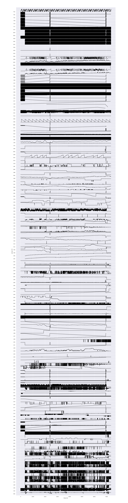

# Connected Car Challenge

This text aims to briefly describe the analysis of the sample data designed for the _Connected Car Challenge_. You can look at the web page of the challenge from  [here](http://occ-challenge.strikingly.com/) and obtain the sample data from [here](https://drive.google.com/file/d/1XIRQkLfjzRjmeDSB8zOmyuJn_C6R62ni/). The sample data sent by _CAN buses_; for obtaining an intuition, look at [this](https://www.csselectronics.com/screen/page/reverse-engineering-can-bus-messages-with-wireshark/language/en). 

## Cleaning the data

As a first step towards understanding the data, we changed it so that we can read values and plot figures from it.

In the first try, we obtain the following from the head of the data:

<table border="1" class="dataframe">
  <tbody>
    <tr>
      <th>0</th>
      <td>(1497925598.604522)</td>
      <td>can0</td>
      <td>233#2F0FFF0C00D10100</td>
    </tr>
    <tr>
      <th>1</th>
      <td>(1497925598.604710)</td>
      <td>can0</td>
      <td>223#890513004A000081</td>
    </tr>
    <tr>
      <th>2</th>
      <td>(1497925598.606356)</td>
      <td>can0</td>
      <td>00E#20E3200004FF40E2</td>
    </tr>
    <tr>
      <th>3</th>
      <td>(1497925598.606391)</td>
      <td>can0</td>
      <td>228#40C040A1</td>
    </tr>
    <tr>
      <th>4</th>
      <td>(1497925598.608609)</td>
      <td>can0</td>
      <td>408#20</td>
    </tr>
  </tbody>
</table>

The first columns corresponds to the time steps the CAN buses send the samples. The third column corresponds to two parts, the one before `#` and the one after `#`. The number before `#` is the _id_ of the measurement (e.g. temperature, acceleration, turbulence) and the next number corresponds to the value of the measurement. Both numbers are in hexadecimal base.

We cleaned the data and separated it into different groups by using of the ids of measurements. We dropped the ids that are (almost) constant. The total number of ids were 268 whilst there were 105 of them with significant information (variations).

We plotted all signals and obtained the following figure:

There are a few things we have to notice here:

1. The signals do not start at the same time. Some of them are registered from time 0 while there are the ones which starts at 350 second later (in 10 minutes). The same story for the endings

2. Some of the signals are just a slight shift (in time) of each other.

3. There are a very highly oscillating signals. We should put a low-pass filter to take a better picture about their evolution.
