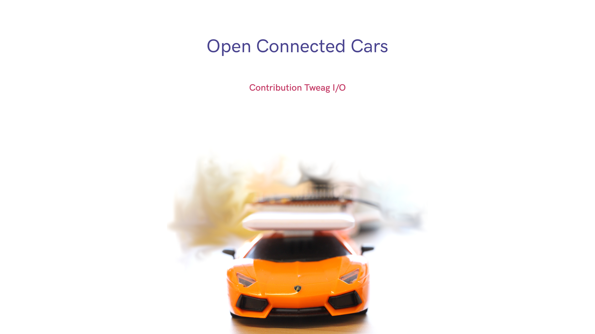

# Project Overview

This project is a contribution to the data engineering challenge http://occ-challenge.strikingly.com/

# Context

The challenge was run by SierraWireless: Sierra Wireless Sierra Wireless is an IoT pioneer, and empowers businesses and industries to transform and thrive in the connected economy. "Sierra Wireless", "Legato" and "mangOH" are registered trademarks of Sierra Wireless.

The challenge turned around the mangOH IoT platform: Sierra Wireless founded the mangOH open hardware community in 2015 to make it easy for developers to prototype their IoT wired, wireless, or sensor technology. What is the challenge about? The challenge is about using the mangOH IoT platform to record and transform sensor data from connected cars. 

# What is our proposed contribution?

We use the embedded sensors to detect a car accident from acceleration data, we monitor the accelerometer on the X axis. A potential accident event is sent to a cloud database where it waits for validation. Validation of the accident is obtained when a dynamic lightweight consensus is reached. The consensus is reached when the mangOH device and two additional smartphones report that validate that they have witnessed an accident. The event is then logged into a data storage that is protected against alteration, in our Poc we have chosen to store it in an Ethereum blockchain.

We have made a live demo of this with a toy car that crashes into a wall. You can find the video [here](https://drive.google.com/file/d/10D3HfoHHuh5RVw9wfgx3e3tmWRSEgqRH/view?usp=sharing).
